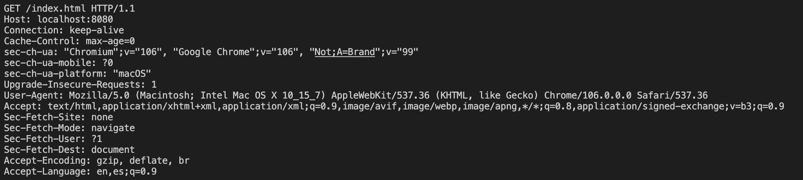
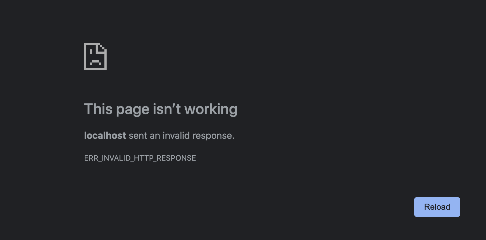
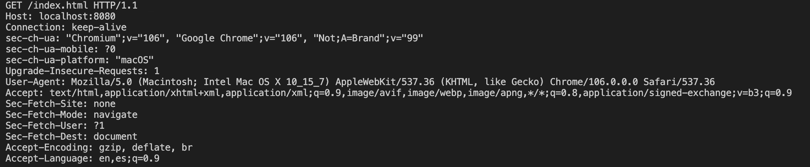

# WEBSERV

## [Index](#index) <a name="index"></a>

1. [To-Do List](#todo)
2. [Requirements](#requirements)
3. [Configuration File](#configuration)
4. [Allowed Functions](#allowedfunctions)
5. [HTTP Server](#httpserver)
6. [Socket](#socket)
7. [Bibliography](#bibliography)
8. [License](#license)

---
## To-Do List <a name="todo"></a>

- Undestand the requirements
- Start Working on the config files and what are they suppose to do
- READ "the RFC" DO SOME TEST WITH "telnet" AND "NGINX" before starting to work in this
- look up what .ipp and .tpp file extensions are
- Make the server show /srcs/html/index.html when trying to access it

---
## __File hierarchy__ <a name="filehierarchy"></a>
```
.
├─ includes
│  ├─ Response.hpp
│  └─ webserv.h
├─ srcs
│  ├─ html
│  │  └─ index.html
│  └─ main.cpp
├─ config
├─ resources
│  └─ images
│      ├─ images
│      │   ├─ http_request.png
│      │   ├─ http_request2.png
│      │   └─ http_browser.png
│      └─ simpleServer
│          ├─ client.cpp
│          ├─ server.cpp
│          └─ Makefile
├─ testers
│  └─ cgi_tester
├─ Makefile
└─ README.md
```
---
## __Requirements__ <a name="requierements"></a>
```
• Your program has to take a configuration file as argument, or use a default path.
• You can’t execve another web server.
• Your server must never block and the client can be bounced properly if necessary.
• It must be non-blocking and use only 1 poll() (or equivalent) for all the I/O operations 
  between the client and the server (listen included).
• poll() (or equivalent) must check read and write at the same time.
• You must never do a read or a write operation without going through poll() (or equivalent).
• Checking the value of errno is strictly forbidden after a read or a write operation.
• You don’t need to use poll() (or equivalent) before reading your configuration file.
• You can use every macro and define like FD_SET, FD_CLR, FD_ISSET, FD_ZERO (understanding 
  what and how they do it is very useful).
• A request to your server should never hang forever.
• Your server must be compatible with the web browser of your choice.
• We will consider that NGINX is HTTP 1.1 compliant and may be used to compare
  headers and answer behaviors.
• Your HTTP response status codes must be accurate.
• You server must have default error pages if none are provided.
• You can’t use fork for something else than CGI (like PHP, or Python, and so forth).
• You must be able to serve a fully static website.
• Clients must be able to upload files.
• You need at least GET, POST, and DELETE methods.
• Stress tests your server. It must stay available at all cost.
• Your server must be able to listen to multiple ports (see Configuration file).
```
---
## __Configuration Files__ <a name="configuration"></a>
```
In the configuration file, you should be able to:
• Choose the port and host of each ’server’.
• Setup the server_names or not.
• The first server for a host:port will be the default for this host:port (that means
it will answer to all the requests that don’t belong to an other server).
• Setup default error pages.
• Limit client body size.
• Setup routes with one or multiple of the following rules/configuration (routes wont
be using regexp):
  ◦ Define a list of accepted HTTP methods for the route.
  ◦ Define a HTTP redirection.
  ◦ Define a directory or a file from where the file should be searched (for example,
    if url /kapouet is rooted to /tmp/www, url /kapouet/pouic/toto/pouet is
    /tmp/www/pouic/toto/pouet).
  ◦ Turn on or off directory listing.
  ◦ Set a default file to answer if the request is a directory.
  ◦ Execute CGI based on certain file extension (for example .php).
  ◦ Make the route able to accept uploaded files and configure where they should
    be saved.
    ∗ Do you wonder what a [CGI][CGI] is?
    ∗ Because you won’t call the CGI directly, use the full path as PATH_INFO.
    ∗ Just remember that, for chunked request, your server needs to unchunked
      it and the CGI will expect EOF as end of the body.
    ∗ Same things for the output of the CGI. If no content_length is returned
      from the CGI, EOF will mark the end of the returned data.
    ∗ Your program should call the CGI with the file requested as first argument.
    ∗ The CGI should be run in the correct directory for relative path file access.
  ∗ Your server should work with one CGI (php-CGI, Python, and so forth).
```
---
## __Allowed functions an usage__ <a name="allowedfunctions"></a>
<table>
  <tr>
    <th>Function</th>
    <th>Prototype</th>
    <th>Description</th>
  </tr>
  <tr>
    <td><a href="https://linux.die.net/man/3/htons">htons</a></td>
    <td><code>uint16_t htons(uint16_t hostshort)</code></td>
    <td>Host To Number Short (#include &ltarpa/inet.h&gt)</td>
    </tr>
    <tr>
    <td><a href="https://linux.die.net/man/3/htonl">htonl</a></td>
    <td><code>uint32_t htons(uint32_t hostlong)</code></td>
    <td>Host To Number Long(#include &ltarpa/inet.h&gt)</td>
    </tr>
  <tr>
    <td><a href="https://linux.die.net/man/3/ntohs">ntohs</a></td>
    <td><code>uint16_t ntohs(uint16_t hostshort)</code></td>
    <td>Number to Hostshort (#include &ltarpa/inet.h&gt)</td>
  </tr>
   <tr>
    <td><a href="https://linux.die.net/man/3/ntohl">ntohl</a></td>
    <td><code>uint32_t ntohl(uint32_t hostlong)</code></td>
    <td>Number to Hostlong (#include &ltarpa/inet.h&gt)</td>
  </tr>
   <tr>
    <td><a href="https://linux.die.net/man/1/select">select</a></td>
    <td><code> int
     select(int nfds, 
     fd_set *restrict readfds, 
     fd_set *restrict writefds, 
     fd_set *restrict errorfds, s
     truct timeval *restrict timeout);</code></td>
    <td>To be Found (#include &ltsys/select.h&gt)</td>
  </tr>
  <tr>
    <td><a href="https://man7.org/linux/man-pages/man2/poll.2.html">poll</a></td>
    <td><code>int poll(struct pollfd fds[], nfds_t nfds, int timeout);</code></td>
    <td>To be Found (#include &ltpoll.h&gt)</td>
  </tr>
  <tr>
    <td><a href="https://man7.org/linux/man-pages/man2/epoll_create.2.html">epoll_create</a></td>
    <td><code>int epoll_create(int flag/size);</code></td>
    <td>To be Found (#include &ltsys/epoll.h&gt)</td>
  </tr>
    <tr>
    <td><a href="https://man7.org/linux/man-pages/man2/epoll_ctl.2.html">epoll_ctl</a></td>
    <td><code>int epoll_ctl(int epfd, int op, int fd, struct epoll_event *event);</code></td>
    <td>Add modify or remove epoll things (#include &ltsys/epoll.h&gt)</td>
  </tr>
   </tr>
    <tr>
    <td><a href="https://man7.org/linux/man-pages/man2/epoll_wait.2.html">epoll_wait</a></td>
    <td><code>int epoll_wait(int epfd, struct epoll_event *events, int maxevents, int timeout);</code></td>
    <td>Waits for an epoll event (#include &ltsys/epoll.h&gt)</td>
  </tr>
  <tr>
    <td><a href="https://www.freebsd.org/cgi/man.cgi?query=kqueue&sektion=2">kqueue</a></td>
    <td><code>int kqueue(void);</code></td>
    <td>To be Found (#include &ltsys/event.h&gt/&ltsys/time.h&gt)</td>
  </tr>
  <tr>
    <td><a href="https://www.daemon-systems.org/man/kevent.2.htmll">kevent</a></td>
    <td><code>int
     kevent(int kq, const struct kevent *changelist, size_t nchanges,
     struct kevent *eventlist, size_t nevents,
     const struct timespec *timeout);</code></td>
    <td>Long to write rn (#include &ltsys/event.h&gt/&ltsys/time.h&gt)</td>
  </tr>
 <tr>
    <td><a href="https://man7.org/linux/man-pages/man2/socket.2.html">socket</a></td>
    <td><code>int socket(int domain, int type, int protocol);</code></td>
    <td>Creates an endpoint for comunication and return an fd for it (#include &ltsys/socket.h&gt)</td>
  </tr>
   <tr>
    <td><a href="https://man7.org/linux/man-pages/man2/accept.2.html">accept</a></td>
    <td><code>int accept(int sockfd, struct sockaddr *restrict addr, socklen_t *restrict addrlen);</code></td>
    <td>Extracts the first connection request on the queue from a socket (#include &ltsys/socket.h&gt)</td>
  </tr>
 <tr>
    <td><a href="https://man7.org/linux/man-pages/man2/accept.2.html">accept</a></td>
    <td><code>int accept(int sockfd, struct sockaddr *restrict addr, socklen_t *restrict addrlen);</code></td>
    <td>Extracts the first connection request on the queue from a socket (#include &ltsys/socket.h&gt)</td>
  </tr>
  <tr>
    <td><a href="https://man7.org/linux/man-pages/man2/listen.2.html">listen</a></td>
    <td><code>int listen(int sockfd, int backlog);</code></td>
    <td>Makes the socket passive, which makes the socket accept connections(#include &ltsys/socket.h&gt)</td>
  </tr>
  <tr>
    <td><a href="https://man7.org/linux/man-pages/man2/send.2.html">send</a></td>
    <td><code>ssize_t send(int sockfd, const void *buf, size_t len, int flags);</code></td>
    <td>Transmits a message to a socket(#include &ltsys/socket.h&gt)</td>
  </tr>
    <tr>
    <td><a href="https://man7.org/linux/man-pages/man2/recv.2.html">recv</a></td>
    <td><code>ssize_t recv(int sockfd, void *buf, size_t len, int flags);</code></td>
    <td>Recieves a message from a socket(#include &ltsys/socket.h&gt)</td>
  </tr>
    <tr>
    <td><a href="https://man7.org/linux/man-pages/man2/bind.2.html">bind</a></td>
    <td><code> int bind(int sockfd, const struct sockaddr *addr, socklen_t addrlen);</code></td>
    <td>Binds a socket name to a address(#include &ltsys/socket.h&gt)</td>
  </tr>
   <tr>
    <td><a href="https://man7.org/linux/man-pages/man2/connect.2.html">connect</a></td>
    <td><code>int connect(int sockfd, const struct sockaddr *addr, socklen_t addrlen);</code></td>
    <td>Connects the socked reffered by sockedfd to the address(#include &ltsys/socket.h&gt)</td>
  </tr>
    <tr>
    <td><a href="https://linux.die.net/man/3/inet_addr">inet_addr</a></td>
    <td><code>in_addr_t inet_addr(const char *cp);</code></td>
    <td>Converts the ipv4 direction to into binary into binary data(#include &ltsys/socket.h&gt)</td>
  </tr>
    <tr>
    <td><a href="https://linux.die.net/man/2/setsockopt">setsockopt</a></td>
    <td><code>int setsockopt(int sockfd, int level, int optname, const void *optval, socklen_t optlen);</code></td>
    <td>Manipulate options of the socket(#include &ltsys/socket.h&gt)</td>
  </tr>
    <tr>
    <td><a href="https://man7.org/linux/man-pages/man2/getsockname.2.html">getsocketname</a></td>
    <td><code>int setsockopt(int sockfd, int level, int optname, const void *optval, socklen_t optlen);</code></td>
    <td>Returns the socked address(#include &ltsys/socket.h&gt)</td>
  </tr>
  <tr>
    <td><a href="https://man7.org/linux/man-pages/man2/fcntl.2.html">fcntl</a></td>
    <td><code>int fcntl(int fd, int cmd, ... /* arg */ );</code></td>
    <td>Performs an operation on the fd based on cmd(#include &ltfcntl.h&gt)</td>
  </tr>
</table>

```Libraries that we are using:```
- [<arpa/inet.h>][arpa/inet.h]
- [<sys/select.h>][sys/select.h]
- [<poll.h>][poll.h]
- [<sys/epoll.h>][sys/epoll.h]
- [<sys/event.h>][sys/event.h]
- [<sys/time.h>][sys/time.h]
- [<sys/socket.h>][sys/socket.h]

---
## __Ok, but what is HTTP?__ <a name="httpserver"></a>

__Hypertext Transfer Protocol__

HTTP is a protocol, a set of rules for data transmission between computers, for fetching resources.
So it is the set of rules servers and clients use to transfers documents on the web back and forth.

HTTP is a "Stateless" procotol, which means that it does not have memory of previus requests. That make users unable to walk through requests because they are not conected.
Even though it is statless it is not Sessionless, which means that the server can store data of you previus request and store them as "cookies". So when you request access back to 
a website you visited it has info about you.
Cookies are saved as HTTP Headers, which can store all kind of data request

So the last basic priciple about it is that it works based on request/response pairs. So every action starts with a request using an HTTP method, and ends with a response of a HTTP status code, along with what happened to the request, data ...

---
## __Really cool, what the actual fuck is a socket?__ <a name="socket"></a>

A socket is a mechanism OSs use to allow programs to access the network. A socket is independet of the network.

The workflow of a socket would be something like:
1. Creating the socket
2. Identifying the socket
3. Make the server wait for an incomming connection
4. Send/Recive messages
5. Closing the socket

## Step One, Creating the socket 

To create a socket we use the fucntion <code>socket();</code>, liste above, which returns a socket_fd.
```c++
int server_fd = socket(domain, type, protocol);
```
All its parameters are integers: __domain (or address family AF)__, the communication domain in which the socket will work (AF_INET, IP | AF_INET6, IPV6 | AF_UNIX, local channel, similar to pipes | ...); __type__, type of the service it'll be using, it varies depending on the properties of the program (SOCK_STREAM, virtual service circuit | SOCK_DGRAM, datagram service | SOCK_RAW, direct IP service), I'd recommend checking with the domain to see if the service is aviable; __protocol__, it indicates which protocol is gonna be used to support the socket operations, some families have multiple protocols so they can support multiple services

For a TCP/IP socket we will be using the IP family address [__AF_INET__][AF_INET], a virtual socket circuit [__SOCK_STREAM__][SOCK_STREAM], and since there are no variations of the protocol the last argument is 0

    AF_INET: Address Family that your socket can comunicate to, in this case Internet Protocol v4 (IPv4).
    SOCK_STREAM: A connection based protocol in which since the connection is established the two ends have a conversation until some end decides to end it. For example, in SOCK_DGRAM you send just one datagram, recive a respond and the comunication ends.
The TCP socket would look something like this:
```c++
#include <sys/socket.h>
...
if ((server_fd = socket(AF_INET, SOCK_STREAM, 0)) < 0){
  write(2, "error\n", sizeof("error\n"));
  return (1);
}
```

## Second Step, Identifying the socket

Identifying or naming a socket means we bind it to an IP and a port, a transfer address. In socket this is called binding. We use <code>bind();</code> function.

The socket address is defined in a socked address structure, because sockets work in many types of comunication this interface is very general. The socket address is defined by the address family. In a AF_UNIX it would create a file.
```c++
int bind(int socket, const struct sockaddr *address, socklen_t address_len);
```
It's first parameter is the socket we just created; The second one is a sockaddr struct, which is a generic structure that allows the OS to detect the Address Family. Depending on the address family we determine what struct to use, for IP networkin __struct sockaddr_in__, defined in netinet/in.h
```c++
struct sockaddr_in 
{ 
    __uint8_t         sin_len; 
    sa_family_t       sin_family; 
    in_port_t         sin_port; 
    struct in_addr    sin_addr; 
    char              sin_zero[8]; 
};
```
Before calling bind we should fill this structure: __sin_family__, the address family we use for out socket (AF_INET); __sin_port__, the port number, you can either assing one or let your OS assing one by default (by assigning 0); __sin_addr__, the IP address of your machine, you can allow you OS to choose the interface by choosing the special one 0.0.0.0 or using __INADDR_ANY__. [struct in_addr][STRUCT IN_ADDR] 

The third parameter is just the size of the structure, it just : 
```c++
sizeof(struct sockaddr_in) 
```

the code that binds the socket would look something like this:
```c++
#include <sys/socket.h>
...
struct sockaddr_in addr;
int port = 8080;
memset( &addr, 0, sizeof(addr));
addr.sin_family = AF_INET;
addr.in_addr.s_addr = htonl(INADDR_ANY); //converts long to a network representation
addr.sin_port = htons(port); //converts a short to a network representation
if (bind(server_fd,(struct sockaddr_in*)&addr, sizeof(addr)) < 0){
    write(2, "error\n", sizeof("error\n"));
    return (1);
}
```
## Third step, wait for a connection on the server

Before any connection happens the server's gotta have a socket waiting for incoming conections. To achive this we use the <code>listen();</code> system call
```c++
int listen(int socket, int backlog);
```
It calls the socket it should be accepting incoming connections from, thats the first parameter. The second one is the amount of pending connections it can handle before starting to refuse them.

The accept function grabs the first connection request that's pending and creates a new socket for it. The socket that was created by the <code>socket();</code> system call is just used for accepting connections. The syntax of accept is:
```c++
int accept(int socket, struct sockaddr *restrict address, socklen_t *restrict address_len);
```
It's parameters are: __socket__, the socket that's set for accepting connections with <code>listen();</code>; __address__, the address thats filled with the client that is trying to connect address; __address_len__, is the lenght of the structure.

The code would look something like this:
```c++
if (listen(server_fd, 3) < 0){
  write(2, "error\n", sizeof("error\n"));
  exit(1);
}
if ((new_socket = accept(socket_fd, (struct sockaddr *)&address, (socklen_t *)&addrlen)) < 0){
  write(2, "error\n", sizeof("error\n"));
  exit (1);
}
``` 

## Step four, Sending and Receiving

Once the connection between the server and the client has been stablished we can start with the info exchange. This part is easier than the previous ones, since we use functions we are all familiar with, <code>read();</code> && <code>write()</code>.

It would look something like this:
```c++
#define BUFF_SIZE 1024
...
char *buffer[BUFF_SIZE];

if ((int reader = read(new_socket, buffer, BUFF_SIZE)) < 0){
  write(2, "error\n", sizeof("error\n"));
  return (1);
}
write(1, buffer, BUFF_SIZE);
char *msg = "Server: Got your request\n";
write(new_socket, msg, strlen(msg));
```

## Final Step, Close the socket

We use the same system call we use when dealing whit FD's: <code>close();</code>
```c++
close(new_socket);
```

## TL;DR

We've learnt how to setup a simple server that works on TCP we can start writting a simple code that creates and server and waits for a request. If you follow this guide you should be able to test if your server is working by googling 0.0.0.0:8080, or 0.0.0.0:X, X being the port you use, but I'd recommend using the 8080.
If you want to see a code doing this jump to [/resources/simpleServer/.](/resources/simpleServer/.)

Ok, now that we've done the TCP part of the code we should start on the HTTP one.

## HTTP

The basics of HTTP communication are that the Client sends an HTTP request to the HTTP server, and then the server processes the request and sends an HTTP response to the HTTPS client.


Now we have to see what are they really sending/requesting

## HTTP Client(Browser)

The client connects to the server, the server cant connect to the user. So the client is who initiates the connection

__http::/www.example.com:8080/index.html__

To display the webpage the browser fetches index.html from the webserver. With www.example.com is the same but with the default(port: 80, file index.html, http protocol). So if you were to type in a browser it would come up with something like __http://www.example.com:80__, so this is what out web browsers send to the internet while we are browsing.

The server can be configured so it has some default settings, like a default page when we visit a folder on the page. The webpage is decided by the name of the file, some servers have index.html others public.html. In this example we'll be using index.html.


We will be testing this with out little server we just made:

1. Run the TCP server
2. Type "__localhost:8080/index.html__" on your browser (instead of localhost you can type 0.0.0.0)
3. Now look at the terminal

You should be seeing something like this:



And your browser should be saying something like this:



Obviously, our response was a message that said __"Yo, Im the server\n"__, the browser cannot read that. 

## HTTP Methods

GET is the default method use by HTTP, but there are 9 Methods:

<table>
  <tr>
    <th>
    <a href="https://developer.mozilla.org/en-US/docs/Web/HTTP/Methods">
      HTTP Methods
    </a>
    </th>
    <th>
      Use
    </th>
  </tr>
  <tr>
    <td>GET</td>
    <td>fetches a URL</td>
  </tr>
  <tr>
    <td>HEAD</td>
    <td>fetches info about URL</td>
  </tr>
  <tr>
    <td>PUT</td>
    <td>Puts a URL</td>
  </tr>
  <tr>
    <td>POST</td>
    <td>Send Data to a URL and get a response back</td>
  </tr>
  <tr>
    <td>DELETE</td>
    <td>Deletes an indicate data</td>
  </tr>
  <tr>
    <td>CONNECT</td>
    <td>Makes a tunel to the server</td>
  </tr>
  <tr>
    <td>OPTIONS</td>
    <td>Describes the communication options for the target</td>
  </tr>
  <tr>
    <td>TRACE</td>
    <td>Performs a message loop-back test along the path to the target resource</td>
  </tr>
  <tr>
    <td>PATCH</td>
    <td>Applies a modification to a resource</td>
  </tr>
</table>

## HTTP Server

Now It's time to start sending responses to the client. The client sends a header expecting a response from us, but we are just responding whit a simple message, let's change that.

The Client's browser is expecting a response in a certain format.

HTTP is nothing more complex than following the rules specified in the [__RFC__][RFC] documentation. 

This is the HTTP notations for responses web-browsers expects us to use:


If we want the client to see the response we first need to send the header, then a blank line and then the message you want. The header shown above is just an example of many, if you want to see more you cant take a look at HTTP RFCs.

Now let's construct a simple header so our server client can see something else than an error:
```c++
char msg[] = "HTTP/1.1 200 OK\nContent-Type: text/plain\nContent-Length: 12\n\nHello world!"; 
```
The 3 minimun headers you've gotta have are these:

1. <code>HTTP/1.1 200 OK</code>, the HTTP version we are using, the Status Code and the Status message
2. <code>Content-Type: text/plain</code>, this says that the content we are sending is just plain text. There are many Content-Types, I'd suggest looking at [__this__][CONTENT-TYPE1] or [__this__][CONTENT-TYPE2]
3. <code>Code-Lenght: 12</code>, the amount of bytes the server is sending to the client, the web-browser wont read more than those

The next part is the body, we need to calculate how many bytes are we sending for the <code>Code-Lenght:</code> and also set the <code>Code-Type:</code> to the apropiate one.

## Status Code and Status Message

Status Codes are issued by the server to the client in response of a request. It includes codes from __IETF__ Request For Comments[(RFC)][RFC], other specifications and some aditional codes used in some common aplications of HTTP.

The first digit of the Status Code specifies one of the five standard classes of responses. The message shown have defaults but human readable alternatives can be shown. Unless stated otherwise the status code is part of the HTTP/1.1 standard [__RFC231__][RFC231].

So, for example, if you can't find the file the client is asking for you send the apropiate status code, if the client is trying to access a file he doesn't have permission to access you send the apropiate status code, and so on...

[__List of HTTP Status Codes__][HTTPS_STATUS-CODES]

If we ran the code we previusly wrote and change the <code>char msg[] = "whatever";</code> to <code>char msg[] = "HTTP/1.1 200 OK\nContent-Type: text/plain\nContent-Length: 12\n\nHello world!";</code>, and then connect to localhost:8080 in you browser you should get something diferent.

## Sending other kind of messages

Now that we've sent a message, how do we send another datatypes (images, webpages, ...). Lets suppose we've entered localhost:8080/index.html, we get this in the terminal:



For simplicitys sake we just consider the first line of the request: <code> GET /info.html HTTP/1.1 </code>. All we have to do is look for index.html in root. If we were to enter localhost:8080/srcs/html/index.html we would have to look insede of /srcs/html/ for this. There are so many cases to consider:

1. The file is present
2. The file is absent
3. The client has no permission to see the file
4. ...
  
First we have to select a status code from [__here__][STATUS-CODE], then we select the content-type [__here__][CONTENT-TYPE3], then you open the file, read the data into a variable, count the amount of bytes and set the <code>Content-Lenght</code>, and then construct the respond header. Then you add a newline and append the data from the file we wanted to send. Once this is done the final step is to just send the Header to the client


Huge Shoutout to [__Skrew Everything__][SE] for making an easy tutorial to understand HTTP servers

---
## __Functions to use and how to use them__

When accepting a request from a server we can use many functions, but those like <code>accept();</code> or <code>recv();</code> are blocking. This can be a problem when a server is trying to handle a big amount of clients, where the server would end up blocking a big amount of clients. So the solution to this problem would be using other socket calls, like <code>select();</code> or <code>poll();</code>, these calls let us handle multiple sockets without blocking none of them

Thanks to [__this guide__][SELECT]

---
## __BIBLIOGRAPHY__ <a name="bibliography"></a>

- [An overview of HTTP][AOFHTTP]
- [Some HTTP things(ESP)][ESP_THING]
- [MND WEB DOCS select function][MND_SELECT]
- [HTTP Server: Everything you need to know to Build a simple HTTP server from scratch][HTTP_SERVER]
- [What is a .tpp file (ESP)][.TPP]
- [What is a .ipp file (ESP)][.IPP]
- [stack overflow AF_INET][AF_INET]
- [stack overflow SOCK_STREAM][SOCK_STREAM]
- [struct sockaddr_in][STRUCT_SOCKADDR_IN]
- [socket programming: socket select][SELECT]
- [socket programming: introduction][SP:INTRO]

## __LICENSE__ <a name="license"></a>
I Do not belive in those things


[//]: #
  [arpa/inet.h]: <https://pubs.opengroup.org/onlinepubs/7908799/xns/arpainet.h.html>
  [sys/select.h]: <https://pubs.opengroup.org/onlinepubs/009695399/basedefs/sys/select.h.html>
  [poll.h]: <https://pubs.opengroup.org/onlinepubs/7908799/xsh/poll.h.html>
  [sys/epoll.h]: <https://man7.org/linux/man-pages/man7/epoll.7.html>
  [sys/event.h]: <https://opensource.apple.com/source/xnu/xnu-792/bsd/sys/event.h.auto.html>
  [sys/time.h]: <https://pubs.opengroup.org/onlinepubs/7908799/xsh/systime.h.html>
  [sys/socket.h]: <https://pubs.opengroup.org/onlinepubs/7908799/xns/syssocket.h.html>
  [CGI]: <https://en.wikipedia.org/wiki/Common_Gateway_Interface>
  [AOFHTTP]: <https://developer.mozilla.org/en-US/docs/Web/HTTP/Overview>
  [ESP_THING]: <http://redesdecomputadores.umh.es/aplicacion/HTTP.          htm#:~:text=Las%20principales%20caracter%C3%ADsticas%20del%20protocolo,la%20transferencia%20de%20objetos%20multimedia>
  [MND_SELECT]: <https://developer.mozilla.org/es/docs/Web/HTML/Element/select>
  [HTTP_SERVER]: <https://medium.com/from-the-scratch/http-server-what-do-you-need-to-know-to-build-a-simple-http-server-from-scratch-d1ef8945e4fa>
  [.TPP]: <http://www.ficheros.org.es/archivo-tpp.php>
  [.IPP]: <ficheros.org.es/archivo-ipp.php>
  [AF_INET]: <https://stackoverflow.com/questions/1593946/what-is-af-inet-and-why-do-i-need-it>
  [SOCK_STREAM]: <https://stackoverflow.com/questions/5815675/what-is-sock-dgram-and-sock-stream>
  [STRUCT_SOCKADDR_IN]: <https://learn.microsoft.com/en-us/windows/win32/api/ws2def/ns-ws2def-sockaddr_in>
  [STRUCT IN_ADDR]: <https://stackoverflow.com/questions/13979150/why-is-sin-addr-inside-the-structure-in-addr>
  [RFC]: <https://www.rfc-editor.org/rfc/rfc2616.html>
  [CONTENT-TYPE1]: <https://developer.mozilla.org/en-US/docs/Web/HTTP/Headers/Content-Type>
  [CONTENT-TYPE2]: <https://www.geeksforgeeks.org/http-headers-content-type/>
  [RFC231]: <https://www.rfc-editor.org/rfc/rfc7231>
  [HTTPS_STATUS-CODES]: <https://en.wikipedia.org/wiki/List_of_HTTP_status_codes>
  [STATUS-CODE]: <https://en.wikipedia.org/wiki/List_of_HTTP_status_codes>
  [CONTENT-TYPE3]: <https://learn.microsoft.com/en-us/previous-versions/exchange-server/exchange-10/ms526508(v=exchg.10)?redirectedfrom=MSDN>
  [SE]: <https://medium.com/from-the-scratch/http-server-what-do-you-need-to-know-to-build-a-simple-http-server-from-scratch-d1ef8945e4fa>
  [SELECT]: <http://codingbison.com/c/c-sockets-select.html>
  [SP:INTRO]: <http://codingbison.com/c/c-sockets-introduction.html>
